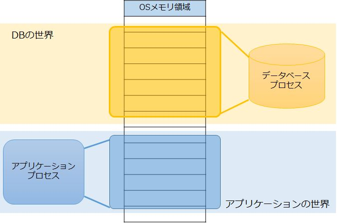
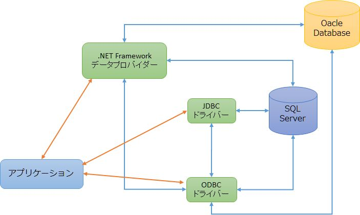

第1章 2つの世界
=====

[↑目次](..\README.md "目次")

DBプログラミングを始めるにあたって、まずはアプリケーションからDBにアクセスするとはどういうことなのか、概念を学んでいきましょう。

## 2つの世界

アプリケーションからDBアクセスするにあたって、大前提として知って置かなければならないことがあります。それは「アプリケーション」と「DB」は異なる世界だということです（図1-1）。例え同じマシン内でそれぞれが動作していたとしても、このことは変わりません。

図1-1 2つの世界

それはどういうことかというと、アプリケーションとDBは「別のプロセスで動いている」ということです。プロセスが異なると、当然使用しているメモリも共有されていないため、お互いに相手の考えていることはわかりません。また、単純にお互いを操作するということも出来ません。

もちろんアプリケーションからDBを操作する方法はありますが、それは2つの異なる世界を越境しているということを忘れてはいけません。当然文化も風習も言葉も違う世界です。情報のやり取りには、ある一定のルールに基づいた「翻訳」が必要です。したがって、アプリケーション内だけで行う処理に比べ、DBを扱う処理は必然的に「重く」なります。

そのため、アプリケーションからDBへアクセスする回数は可能なかぎり少なくして、パフォーマンス上の問題が起きないように心がける必要があります。

## 世界の架け橋

それでは異なる2つの世界をどうやって繋げばよいのでしょうか？その役割を担うのが、「データベース・ドライバー」（以下DBドライバー）です（図1-2）。

図1-2 データベース・ドライバー

DBドライバーは、各種のプラットフォーム、プログラミング言語向けに、DBへアクセスするための「窓口」を提供します。アプリケーションがこの窓口を相手に話すと、DBドライバーは対象のDB向けにそれを翻訳して、処理を仲介してくれるのです。

そのため、各プラットフォーム、プログラミングとDB製品の組み合わせ毎にDBドライバーは用意されています。提供元はDB製品の開発元だったり、プラットフォーム、プログラミング言語の開発元だったり、全くの第三者（サードパーティ）だったりと様々です。

例えば、プログラミング言語の1つであるJavaは各DB製品用に「JDBCドライバー」という名前のDBドライバーがあります。また、Windows上では「ODBCドライバー」という各DB製品向けに汎用的な窓口を提供するDBドライバーもあります。各プラットフォーム、プログラミング言語では、更にODBCドライバーを操作するためのドライバーを経由して、ODBCドライバーとやり取りしてDBにアクセスします。

図1-3 DBドライバーの組み合わせ

そして、.NET Frameworkに用意されたDBドライバーが「.NET Framework データプロバイダー（以下単にデータプロバイダー）」です。次の章では、このデータプロバイダーについて学んでいきましょう。

[→第2章 データ プロバイダー](02-data-provider.md)
