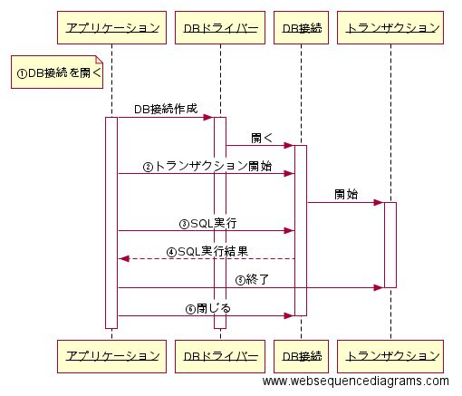
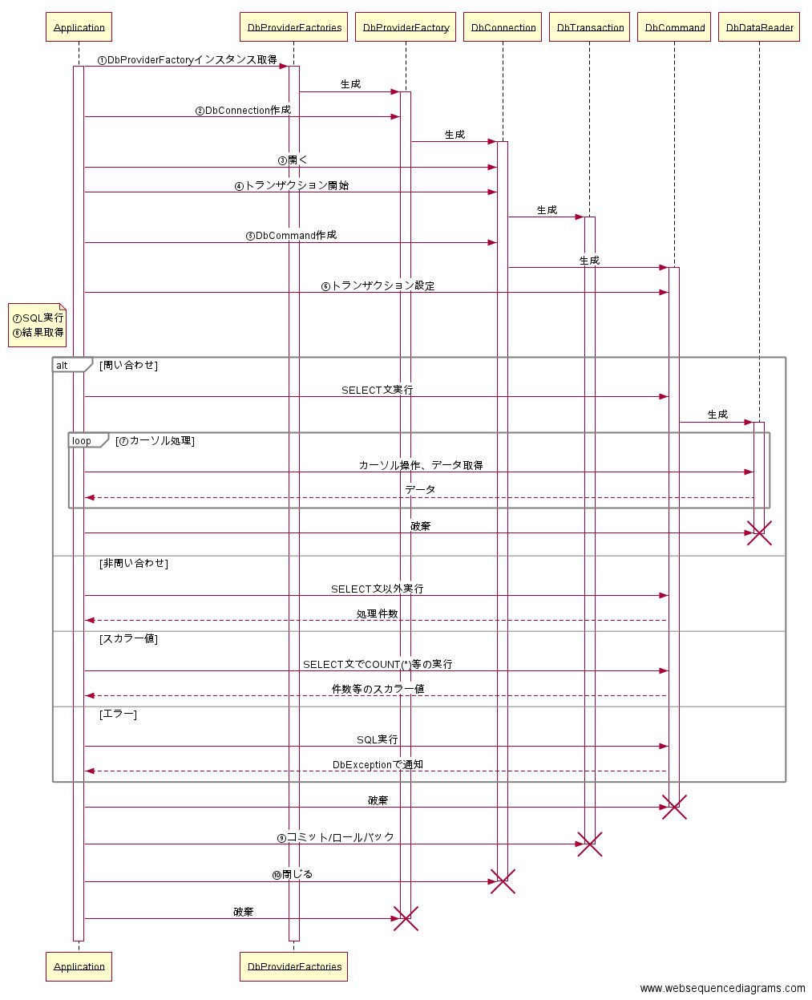

第2章 データプロバイダー
=====

[↑目次](..\README.md "目次")

[←第1章 2つの世界](01-two-worlds.md)

.NET FrameworkからDBアクセスするためのDBドライバーが「データプロバイダー」です。その構成や処理イメージを学んでいきましょう。

## DBアクセスのイメージ

データプロバイダーの構成を学ぶ前に、今一度「DBアクセスする」というのはどういう手順で行うのか考えてみましょう。アプリケーションのプラットフォームやプログラミング言語によって多少の違いはあるかもしれませんが、おおまかに次のような流れになるはずです。

図2-1 DBアクセスイメージ

1. データベース接続を開く
2. トランザクションを開始する
3. SQLを実行する
4. SQL実行結果を受け取る
5. トランザクションを終了する
6. データベース接続を閉じる

## 1. データベース接続を開く

第1章で述べたとおり、アプリケーションからDBにアクセスするには、DBドライバーを経由する必要があります。この時、DBドライバーとDBの間には「データベース接続」（以下DB接続）と呼ばれる、専用のアクセス通路のようなものが構築されます。そして、アプリケーション側ではDBドライバーが作成したDB接続を「借りて」DBにアクセスします。

このようにDB接続を作成してDBアクセス可能な状態にすることを、「DB接続を開く」といいます。

## 2. トランザクションを開始する

意味のある処理の塊をまとめるために「トランザクション」が必要なら、DB接続に対してトランザクション開始を指示します。

## 3. SQLを実行する

DB操作のための準備が整ったところで、SQLを実行します。この時実行するSQLは、データベースオブジェクト等を操作するDDL、テーブルデータの登録、参照、更新、削除（CRUD：Create, Read, Update, Delete）を行うDMLに加えて、ストアドプロシージャの呼び出し等もあります。

## 4. SQL実行結果を受け取る

SQLを実行したら、その結果を受け取ります。DMLの場合、SELCT文ならDBの機能である「カーソル」を制御するためのオブジェクト、INSERT、UPDATE、DELETE文なら処理が行われたレコード件数が受け取れます。

この他、データベース側で発生したエラー情報も、例外等を使って受け取ることが出来ます。

## 5. トランザクションを終了する

必要なSQLの実行を終えたら、トランザクションをコミットもしくはロールバックして終了させます。なお、トランザクションを明示的に開始していない場合は、SQLを実行したタイミングで自動的にコミットも行われます。

## 6. データベース接続を閉じる

DBアクセスする処理を終えたら、DB接続をDBドライバー側に返却します。このことを「DB接続を閉じる」といいます。

# データプロバイダーの構成

DBアクセス手順のイメージが分かったところで、データプロバイダーの構成について説明していきましょう。

データプロバイダーはSystem.Data名前空間に定義された各種インターフェイス群、その各種インターフェースを最低限実装したSystem.Data.Common名前空間に定義された抽象クラス群、そしてその抽象クラス群を継承して各種DB製品ごとに特化したクラス群で成り立っています。

この中で特に重要なのが以下のインターフェースと抽象クラスです。

| 型名           | 説明                       |
|----------------|----------------------------|
| IDbConnection  | データベース接続を管理する |
| IDbTransaction | トランザクションを管理する |
| IDbCommand     | SQLの実行を行う            |
| IDataReader    | カーソルを管理する         |

表2-1 System.Data名前空間のインターフェイス

| 型名              | 説明                                 |
|-------------------|--------------------------------------|
| DbConnection      | データベース接続を管理する           |
| DbTransaction     | トランザクションを管理する           |
| DbCommand         | SQLの実行を行う                      |
| DbDataReader      | カーソルを管理する                   |
| DbProviderFactory | 上記のクラスのインスタンスを生成する |
| DbException       | DBで発生したエラー情報を通知する     |

表2-2 System.Data.Common名前空間の抽象クラス

以上のインターフェイス、抽象クラスを使ったDBアクセスのイメージは、次のようになります（図2-2）。

図2-2 データプロバイダーによるDBアクセス手順

1. DbProviderFactoryインスタンス取得
2. DbProviderFactoryインスタンスを使いDbConnectionインスタンス作成
3. DbConnectionインスタンを使ってデータベース接続を開く
4. DbConnectionインスタンスを使いトランザクションを開始し、DbTransactionインスタンス作成
5. DbConnectionインスタンスを使い、DbCommandインスタンスを作成
6. トランザクションを使うなら、DbCommandインスタンスにDbTransactionインスタンスを設定
7. DbCommandインスタンスを使いSQL実行
8. SQLの実行結果に応じたオブジェクトを受け取る
    - SELECT文ならDbDataReaderインスタンス
    - SELECT文以外は処理件数
    - 件数等のスカラー値はその値
    - エラー発生時はDbException
9. DbTransactionインスタンスを使ってトランザクションをコミット/ロールバック
10. DbConnectionインスタンスを使ってデータベース接続を閉じる

ここでの大事なポイントはDbProviderFactoriesクラスです。System.Data.Common名前空間に定義された各種のクラスは「抽象クラス」であり、実際にアプリケーションで使用する際は、各種のDB製品に特化したそれらの派生クラスを使う必要があります。しかし、その派生クラスを直接扱ってしまうと、DB製品の仕様にアプリが引きずられてしまいます。これを避けるために、各製品別の派生クラスを生成する役目を担うのが、DbProviderFactoriesクラスです。

DbProviderFactoriesクラスを利用するには、先に使用したいデータプロバイダーの情報を「アプリケーション構成ファイル」に記載しておきます。すると、アプリ側で「データプロバイダー名」を指定して特定DBに特化したDbProviderFactory派生クラスのインスタンスを取得できます。あとは手順2.のように、DbProviderFactoryのDbConection生成メソッドを使うことで、DbConnection派生クラスインスタンスを生成し、その後DbConnection派生クラスインスタンスから、トランザクションやSQL実行用クラスのインスタンスを生成して利用できます。

なお、.NET Frameworkには予め幾つかのDB製品向けの特化クラス群がすでに含まれています。ただ、SQL Server等のMicorsoft社製品以外は参考実装扱いなので、第三者が作成したデータプロバイダーを用いることになります。それでも、上記の基本的なインターフェイス、抽象クラスがあるため、SQL Server等と同じ書き方ができるのです。

もちろん上記のやり方でなく特定DB製品に特化した各種派生クラスのインスタンスを直接newで生成することも出来ますが、どんな製品でも使える基本的な構文や使い方を覚えるため、本文書ではこの形式で以後の説明を進めていきます。

それでは、次の章からはOracle社のデータベース製品である「Oracle Database」に対して、専用のデータプロバイダー「ODP.NET」を用いて、実際にDBアクセスするための方法を学んでいきましょう。

[→第3章 DBに接続する](03-connect-to-db.md)
