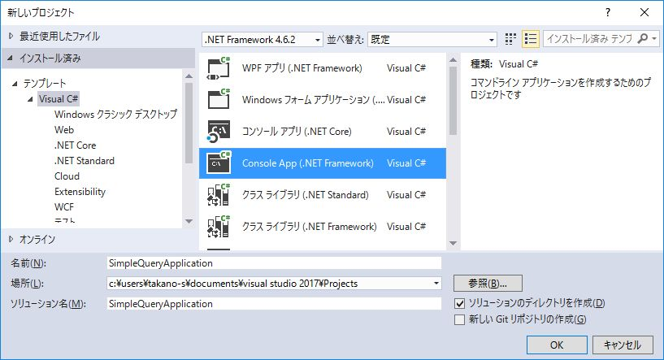

第3章 DBに接続する
=====

[↑目次](..\README.md "目次")

[←第2章 データ プロバイダー](02-data-provider.md)

データ プロバイダーの構成やDBアクセスの手順の大枠がわかったところで、今度は具体的な内容に入っていきましょう。まずはDBに接続する方法からです。

## ODP.NET

本文書ではサンプルデータベースにOracle Databaseを用います。Oracl Database向けのデータプロバイダーは、実は.NET FrameworkにもSystem.Data.OracleClient名前空間に含まれています。ただし、現在は非推奨になっていること、7i、8i、9iなど過去のバージョン向けであることから、使わないようにしてください。

その代わり、Oracle社から提供されている「ODP.NET」を用います。ODP.NETはOracle向けODBCドライバー等の各種データアクセス用コンポーネント群をまとめた「[Oracle Data Access Components（ODAC）](64ビットのOracle Data Access Components（ODAC）のダウンロード http://www.oracle.com/technetwork/jp/database/windows/downloads/index-214820-ja.html)」に含まれる、Oracle専用データプロバイダーです。

ODP.NETを使用するには、上記ODACをマシンにインストールする方法に加え、NuGet（※）によるインストールにも対応しています。今回は後者の方法でインストールします。

※NuGet
.NETアプリケーション開発のためのライブラリ配布、管理を行う「パッケージ マネージャー」である。多くのライブラリ等が「[NuGet Gallery](https://www.nuget.org/)」で公開されている。

## ODP.NETのインストール

まずdb接続を行うサンプルアプリケーションを、コンソールアプリケーションとして作成します（図3-1）。

図3-1 プロジェクト作成

次にNuGetパッケージをインストールするため、「ツール」メニュー→「NuGet パッケージ マネージャー」→「ソリューションの NuGet パッケージの管理」を選択します（図3-2）。

図3-2 NuGet パッケージの管理

「ソリューションのパッケージの管理」画面が表示されたら、「参照」タブを選び、テキストボックスに"oracle.manageddataaccess"と入力し、ODP.NETを検索します（図3-3）。

図3-3 ODP.NETの検索

「Oracle.ManagedDataAcess」を選択後、インストール先プロジェクトである「SimpleQueryApplication」にチェックを入れ、「インストール」ボタンをクリックします（図3-4）。

図3-4 ODP.NETのインストール

「プレビュー」ダイアログが表示されたら、「OK」ボタンをクリックします（図3-5）。

図3-5 インストールプレビューダイアログ

「ライセンスへの同意」ダイアログが表示されたら、ライセンスを確認して「同意する」ボタンをクリックします（図3-6）。

図3-6 ライセンスへの同意ダイアログ

ODP.NETのインストールが行われます。インストールした結果、プロジェクトにOracle.ManagedDataAcess.dllファイルへのライブラリ参照が追加されるとともに、アプリケーション構成ファイル（App.config）にもODP.NETを使うための記述が追加されます（）。

図3-7 パッケージインストール結果

なお、ODACをインストールした場合は、プロジェクトのプロパティより「アセンブリ」→「拡張」欄に表示される「Oracle.ManagedDataAccess」への参照を追加すること。

[→第4章 単純な問い合わせ](04-execute-query.md)
