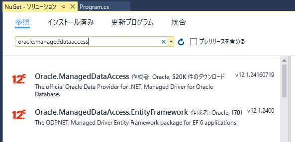
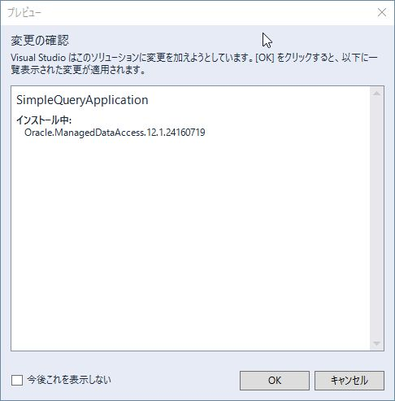
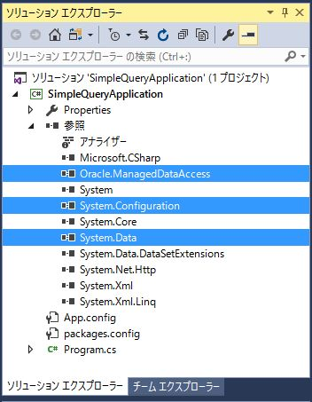
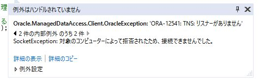

第3章 DBに接続する
=====

[↑目次](..\README.md "目次")

[←第2章 データプロバイダー](02-data-provider.md)

データプロバイダーの構成やDBアクセスの手順の大枠がわかったところで、今度は具体的な内容に入っていきましょう。まずはDBに接続する方法からです。なお、本文書ではローカルPCにOracle Databaseがインストールされている前提で以後の説明を進めます。

## ODP.NET

Oracl Database向けのデータプロバイダーは、実は.NET FrameworkにもSystem.Data.OracleClient名前空間として含まれています。ただし、現在は非推奨になっていること、7i、8i、9iなど過去のバージョン向けであることから、使わないようにしてください。

その代わり、Oracle社から提供されている「ODP.NET」を用います。ODP.NETはOracle Database専用データプロバイダーで、、Oracle Databes向けODBCドライバー等の各種データアクセス用コンポーネント群をまとめた「[Oracle Data Access Components（ODAC）](http://www.oracle.com/technetwork/jp/database/windows/downloads/index-214820-ja.html)」にも含まれています。ODP.NETを使用するには、ODACをマシンにインストールするか、後述するNuGet（※）によるパッケージインストールを粉います。

※NuGet
.NETアプリケーション開発のためのライブラリ配布、管理を行う「パッケージ マネージャー」である。多くのライブラリ等が「[NuGet Gallery](https://www.nuget.org/)」で公開されている。


## ODP.NETのインストール

まずDBに接続して開くだけのサンプルアプリケーションを、コンソールアプリケーションとして作成します（図3-1）。


図3-1 プロジェクト作成

次にNuGetパッケージをインストールするため、「ツール」メニュー→「NuGet パッケージ マネージャー」→「ソリューションの NuGet パッケージの管理」を選択します（図3-2）。


図3-2 NuGet パッケージの管理

「ソリューションのパッケージの管理」画面が表示されたら、「参照」タブを選び、テキストボックスに"oracle.manageddataaccess"と入力し、ODP.NETを検索します（図3-3）。



図3-3 ODP.NETの検索

「Oracle.ManagedDataAcess」を選択後、インストール先プロジェクトである「SimpleQueryApplication」にチェックを入れ、「インストール」ボタンをクリックします（図3-4）。


図3-4 ODP.NETのインストール

「プレビュー」ダイアログが表示されたら、「OK」ボタンをクリックします（図3-5）。



図3-5 インストールプレビューダイアログ

「ライセンスへの同意」ダイアログが表示されたら、ライセンスを確認して「同意する」ボタンをクリックします（図3-6）。


図3-6 ライセンスへの同意ダイアログ

ODP.NETのインストールが行われます。インストールした結果、プロジェクトにOracle.ManagedDataAcess.dllファイルへのライブラリ参照が追加されるとともに、アプリケーション構成ファイル（App.config）にもODP.NETを使うための記述が追加されます（）。


図3-7 パッケージインストール結果

なお、ODACをインストールした場合は、直接ODACインストール先のdllファイルへの参照をプロジェクトに追加します。その手順は、プロジェクトを右クリックして［追加］→［参照］を選択して「参照マネージャー」画面を開いた後、［参照］ボタンをクリックしてODACインストール先フォルダー内の「\client_1\odp.net\managed\common\Oracle.ManagedDataAccess.dll」ファイルを選択し、［追加］ボタンをクリックすればよいです。


図3-8 Oracle.ManagedDataAccess.dllの直接参照

## DBアクセス準備

ODP.NETのインストールが終わったので、今度は実際に接続するための準備を進めていきます。まず、ODP.NETに含まれるDbProviderFactory型派生クラスのインスタンスを取得するため、アプリケーション構成ファイルの設定を行います（リスト3-1）。

リスト3-1 アプリケーション構成ファイル設定（App.configより）

```xml
<?xml version="1.0" encoding="utf-8"?>
<configuration>
  <!-- (1) -->
  <configSections>
    <section name="oracle.manageddataaccess.client" type="OracleInternal.Common.ODPMSectionHandler, Oracle.ManagedDataAccess, Version=4.121.2.0, Culture=neutral, PublicKeyToken=89b483f429c47342"/>
  </configSections>
  <startup>
    <supportedRuntime version="v4.0" sku=".NETFramework,Version=v4.6.1"/>
  </startup>
  <!-- (2) -->
  <system.data>
    <DbProviderFactories>
      <remove invariant="Oracle.ManagedDataAccess.Client"/>
      <add name="ODP.NET, Managed Driver" invariant="Oracle.ManagedDataAccess.Client" description="Oracle Data Provider for .NET, Managed Driver" type="Oracle.ManagedDataAccess.Client.OracleClientFactory, Oracle.ManagedDataAccess, Version=4.121.2.0, Culture=neutral, PublicKeyToken=89b483f429c47342"/>
    </DbProviderFactories>
  </system.data>
  <!-- (3) -->
  <runtime>
    <assemblyBinding xmlns="urn:schemas-microsoft-com:asm.v1">
      <dependentAssembly>
        <publisherPolicy apply="no"/>
        <assemblyIdentity name="Oracle.ManagedDataAccess" publicKeyToken="89b483f429c47342" culture="neutral"/>
        <bindingRedirect oldVersion="4.121.0.0 - 4.65535.65535.65535" newVersion="4.121.2.0"/>
      </dependentAssembly>
    </assemblyBinding>
  </runtime>
  <!-- (4) -->
  <oracle.manageddataaccess.client>
    <version number="*">
      <dataSources>
        <!-- (5) -->
        <dataSource alias="ORCL"
          descriptor="(DESCRIPTION=(ADDRESS=(PROTOCOL=tcp)(HOST=hostname)(PORT=1521))(CONNECT_DATA=(SERVICE_NAME=ORCL))) "/>
      </dataSources>
    </version>
  </oracle.manageddataaccess.client>
  <!-- (6) -->
  <connectionStrings>
    <add name="SCOTT"
      providerName="Oracle.ManagedDataAccess.Client"
      connectionString="Data Source=ORCL;User Id=scott;Password=tiger;" />
  </connectionStrings>
</configuration>
```

(1)から(4)については先ほどNuGetでODP.NETをインストールした時に自動で追加された部分です。ODACをインストールした場合は、(2)と(3)はマシンで共通の構成ファイル（machine.config）に追加されるので、自分でApp.configに書く必要はありません。

ポイントは(5)と(6)です。

### (5) データソース設定

(4)に含まれるoracle.manageddataaccess > version > dataSources > dataSource要素が接続先のOracleサーバー情報を記載する箇所です。alias属性には(6)で使用するデータソース名を指定し、descripter要素に実際の接続情報を指定します。記載内容はtnsnames.oraファイルに書くものと全く同じです。なお、HOST項目は既定では"localhost"が設定されています。接続先のOracle Databaseサーバーがローカルにインストールされているものではないときは、対象となるホストマシン名を指定するようにしてください。

### (6) 接続文字列設定

次にプログラム無いから(5)で指定したデータソースに接続するための「データベース接続文字列（以下、DB接続文字列）」情報を追加します。name属性にはプログラム内からこの接続文字列を取得する際に使用する名前、providerName属性には(2)のsystem.data > DbProviderFactories > add要素のinvariant属性で指定した名前を設定します。そして最も大事なconnectionString属性には、接続に使用するデータソース名（Data Source、(5)のalias属性に指定した値）、ユーザー、パスワードをそれぞれ指定します。今回はOracle Databaseに付属するサンプルスキーマ「SCOTT」に接続します。

なお、接続文字列にはもっと詳細な設定も可能です。てより詳しい内容は、次のURLを参照してください。

[Oracle Data Provider for .NET / ODP.NET Connection Strings - ConnectionStrings.com](http://www.connectionstrings.com/oracle-data-provider-for-net-odp-net/)


## 必要ライブラリ参照

次にDBアクセスに必要なライブラリ参照を追加します。次のライブラリへの参照をプロジェクトに追加します（図3-8）。

| ライブラリ名         | 説明                                                     |
|----------------------|----------------------------------------------------------|
| System.Data          | データプロバイダー本体                                  |
| System.Configuration | 接続文字列情報をアプリケーション構成ファイルから読み込む |

表3-1 DBアクセスに必要なライブラリ



図3-9 ライブラリ参照状況

これでようやくOracle Databaseにアクセスするコードを書く準備ができました。

## DB接続処理

それでは実際にDB接続を開いて閉じるだけのプログラムを書いてみましょう（リスト3-2）。

リスト3-2 DB接続処理（Program.cs）

```csharp
// (1) 名前空間のインポート
using System.Configuration;
using System.Data.Common;

namespace SimpleQueryApplication
{
  class Program
  {
    static void Main(string[] args)
    {
      // (2) DB接続文字列情報の取得
      var connectionStringSettings = ConfigurationManager.ConnectionStrings["SCOTT"];

      // (3) DbProficerFactoryインスタンスの生成、取得
      var dbProviderFactory = DbProviderFactories.GetFactory(connectionStringSettings.ProviderName);

      // (4) DB接続オブジェクトを作成
      using (var dbConnection = dbProviderFactory.CreateConnection())
      {
        // (5) DB接続文字列の設定
        dbConnection.ConnectionString = connectionStringSettings.ConnectionString;

        // (6) DB接続を開く
        dbConnection.Open();

        // TODO : SQL実行処理をここに書く

        // (7) DB接続を閉じる
        dbConnection.Close();
      }
    }
  }
}
```

### (1) 名前空間のインポート

まず最初に、参照したライブラリの名前空間をusing句でインポートしましょう。以下の2つの名前空間がひつようです。

- System.Configuration
- System.Data.Common

### (2) DB接続文字列情報の取得

次にApp.configで設定したDB接続文字列情報を、ConfigurationManagerクラスのConnectionString静的プロパティを使って取得します。このプロパティはConnectionStringSettingsCollection型であり、インデクサ引数としてリスト3-1の(6)で指定したname属性の値を指定することで、対応するDB接続文字列情報が取得できます。

### (3) DbProviderFactoryインスタンスの生成、取得

続いてDbProviderFactoriesクラスのGetFactory静的メソッドを使い、ODP.NETのDbProviderFactory派生クラスのインスタンスを生成、取得します。引数にはデータプロバイダー名を指定します。今回はDB接続文字列情報のProviderNameプロパティを使用しています。これは、プログラムコード内に直接データプロバイダー名を書かずに済ませるためです。

### (4) DB接続オブジェクト作成

(3)で取得したDbProviderFactoryインスタンスのCreateConnectionメソッドを呼び出し、DB接続オブジェクトを作成します。この時、using文を使っているのは、DbConnectionクラスがIDisposableインターフェイスを実装しており、必ずDisposeメソッドを最後に呼び出す必要が有るためです。

DbConnectionクラスに限らず、DBアクセスに関するクラスの大部分がIDisposableインターフェイスを実装しています。これは、アプリケーションの「外」にあるDBとやり取りする都合上、仕方のない事です。

### (5) DB接続文字列の設定

(4)で作成したDB接続オブジェクトはまだまっさらの状態で、どこに接続に行けば良いかも知らない状態です。そこで、(1)で取得したDB接続文字列情報から、DB接続文字列を設定してやります。

### (6) DB接続を開く

これでDBにセス属する準備ができましたので、Openメソッドを呼び出してDB接続を開きます。SQL実行やトランザクション開始などは、DB接続を開く前には実行できません。DB接続オブジェクトを作成した後は、必ず開いてから次の処理を行ってください。

### (7) DB接続を閉じる

SQLの実行などのDBアクセス処理を終えたら、最後にCloseメソッドを呼び出してDB接続を閉じましょう。なお、CloseメソッドとDisposeメソッドは実質的に同じ処理を行っていますので、using文を使っていればCloseメソッドの呼び出しを省略することも出来ます。ただ、私としては、処理の対称性と言った意味から、Closeメソッドは省略しないことにしています。

## エラー発生時の対処

プログラムを実行した際、設定ミスなどによりOracle Database接続を開くことができず例外（OracleException）が発生することがあります。VSからデバッグ実行している場合、発生した例外を確認できるので、そのパターンごとに対処方法を説明していきましょう。

### ORA-12545: ネットワーク・トランスポート:接続ホスト名を解決できません


図3-10 ORA-12545: ネットワーク・トランスポート:接続ホスト名を解決できません

「ORA-12545: ネットワーク・トランスポート:接続ホスト名を解決できません」が発生された場合、app.configファイルに設定したデータソースの`HOST`の値が間違っていないか確認してください。

### ORA-12541: TNS: リスナーがありません



図3-11 ORA-12541: TNS: リスナーがありません

「ORA-12541: TNS: リスナーがありません」が発生した場合、app.configファイルに設定したデータソースの`PORT`の値が間違っていないか確認してください。間違っていないようなら、接続先ホストのファイアウォールで指定したポートがブロックされていないか確認してみてください。それでも問題ない場合は、接続先のリスナーが起動しているか確認してください。


図3-12 リスナー稼働状態の確認

### ORA-12514: TNS: リスナーは接続記述子でリクエストされたサービスを現在認識していません


図3-13 ORA-12514: TNS: リスナーは接続記述子でリクエストされたサービスを現在認識していません

「ORA-12514: TNS: リスナーは接続記述子でリクエストされたサービスを現在認識していません」が発生した場合、app.configファイルに設定したデータソースの`SERVICE_NAME`の値が間違っていないか確認してください。ありがちなミスとしては、Oracle Database側のサービス名は「Oracle**.example.com**」のようにFDQN（完全修飾ドメイン名）が設定されているのに、ドメイン部分「.example.com」を省略して指定している、といったことがあります。


さて、ODP.NETをインストールし、DBに接続を開くことが出来るようになったので、次の章から具体的なSQL実行方法を順に学んでいきましょう。


[→第4章 単純な問い合わせ](04-execute-query.md)
