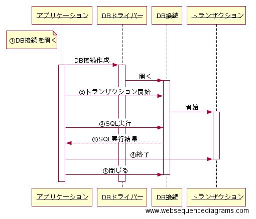

第3章 DBに接続する
=====

[↑目次](..\README.md "目次")

[←第2章 データ プロバイダー](02-data-provider.md)

データ プロバイダーの構成やDBアクセスの手順の大枠がわかったところで、今度は具体的な内容に入っていきましょう。まずはDBに接続する方法からです。

## ODP.NET

本文書ではサンプルデータベースにOracle Databaseを用います。Oracl Database向けのデータプロバイダーは、実は.NET FrameworkにもSystem.Data.OracleClient名前空間に含まれています。ただし、現在は非推奨になっていること、7i、8i、9iなど過去のバージョン向けであることから、使わないようにしてください。

その代わり、Oracle社から提供されている「ODP.NET」を用います。ODP.NETはOracle向けODBCドライバー等の各種データアクセス用コンポーネント群をまとめた「[Oracle Data Access Components（ODAC）](64ビットのOracle Data Access Components（ODAC）のダウンロード http://www.oracle.com/technetwork/jp/database/windows/downloads/index-214820-ja.html)」に含まれる、Oracle専用データプロバイダーです。

ODP.NETを使用するには、上記ODACをマシンにインストールする方法に加え、NuGet（※）によるインストールにも対応しています。今回は後者の方法でインストールします。

※NuGet
.NETアプリケーション開発のためのライブラリ配布、管理を行う「パッケージ マネージャー」である。多くのライブラリ等が「[NuGet Gallery](https://www.nuget.org/)」で公開されている。

図2-1 DBアクセスイメージ

1. データベース接続を開く
2. トランザクションを開始する
3. SQLを実行する
4. SQL実行結果を受け取る
5. トランザクションを終了する
6. データベース接続を閉じる

## 1. データベース接続を開く

第1章で述べたとおり、アプリケーションからDBにアクセスするには、DBドライバーを経由する必要があります。この時、DBドライバーとDBの間には「データベース接続」（以下DB接続）と呼ばれる、専用のアクセス通路のようなものが構築されます。そして、アプリケーション側ではDBドライバーが作成したDB接続を「借りて」DBにアクセスします。

このようDB接続を作成してDBアクセス可能な状態にすることを、「DB接続を開く」といいます。

## 2. トランザクションを開始する

意味のある処理の塊をまとめる「トランザクション」が必要なら、DB接続に対してトランザクション開始を指示します。

## 3. SQLを実行する

SQL文を発行する準備が整ったところで、SQLを実行します。この時実行するSQLは、データベースオブジェクト等を操作するDML、テーブルデータの登録、参照、更新、削除（CRUD：Create, Read, Update, Delete）を行うDMLに加えて、ストアドプロシージャの呼び出し等もあります。

## 4. SQL実行結果を受け取る

SQLを実行したら、その結果を受け取ります。DMLの場合、SELCT文ならDBの機能である「カーソル」を制御するためのオブジェクト、INSERT、UPDATE、DELETE文なら処理が行われたレコード件数が受け取れます。

この他、データベース側で発生したエラー情報も、例外等を使って受け取ることが出来ます。

## 5. トランザクションを終了する

必要なSQLの実行を終えたら、トランザクションをコミットもしくはロールバックして終了させます。なお、トランザクションを明示的に開始していない場合は、SQL実行とともに自動でコミットされます。

## 6. データベース接続を閉じる

DBアクセスする処理を終えたら、DB接続をDBドライバー側に返却します。このことを「DB接続を閉じる」といいます。

# データ プロバイダーの構成

DBアクセス手順のイメージが分かったところで、データ プロバイダーの構成について説明していきましょう。

データ プロバイダーはSystem.Data名前空間に定義された各種インターフェイス群、System.Data.Common名前空間に定義された各種インターフェースを最低限実装した抽象クラス群、そしてその抽象クラス群を継承して各種DB製品ごとに特化したクラス群で成り立っています。

この中で特に重要なのが以下のインターフェースと抽象クラスです。

| 型名           | 説明                       |
|----------------|----------------------------|
| IDbConnection  | データベース接続を管理する |
| IDbTransaction | トランザクションを管理する |
| IDbCommand     | SQLの実行を行う            |
| IDataReader    | カーソルを管理する         |

表2-1 System.Data名前空間のインターフェイス

| 型名              | 説明                                 |
|-------------------|--------------------------------------|
| DbConnection      | データベース接続を管理する           |
| DbTransaction     | トランザクションを管理する           |
| DbCommand         | SQLの実行を行う                      |
| DbDataReader      | カーソルを管理する                   |
| DbProviderFactory | 上記のクラスのインスタンスを生成する |
| DbException       | DBで発生したエラー情報を通知する     |

表2-2 System.Data.Common名前空間の抽象クラス

以上のインターフェイス、抽象クラスを使ったDBアクセスのイメージは、次のようになります（図2-2）。

図2-2 データ プロバイダーによるDBアクセス手順

1. DbProviderFactoryインスタンス取得
2. DbProviderFactoryインスタンスを使いDbConnectionインスタンス作成
3. DbConnectionインスタンを使ってデータベース接続を開く
4. DbConnectionインスタンスを使いトランザクションを開始し、DbTransactionインスタンス作成
5. DbConnectionインスタンスを使い、DbCommandインスタンスを作成
6. DbCommandインスタンスを使いSQL実行
7. SQLの実行結果に応じたオブジェクトを受け取る
    - SELECT文ならDbDataReaderインスタンス
    - SELECT文以外は処理件数
    - 件数等のスカラー値はその値
    - エラー発生時はDbException
8. DbTransactionインスタンスを使ってトランザクションをコミット/ロールバック
9. DbConnectionインスタンスを使ってデータベース接続を閉じる

ここでの大事なポイントはDbProviderFactory抽象クラスとDbConnection抽象クラスです。

.NETアプリケーションでは「アプリケーション構成ファイル」という設定ファイルを使うことで、特定DB製品に特化したDbProviderFactory派生クラスのインスタンスを生成できる機能があります。これを利用すると、手順2で特定DB製品専用のDbConnection派生クラスインスタンスが生成できます。あとは特定DBに特化したDbConnection派生クラスインスタンスより、各種の抽象クラスを継承した各種の特化クラス群のインスタンスを生成できるようになります。

なお、.NET Frameworkには予め幾つかのDB製品向けの特化クラス群がすでに含まれています。ただ、SQL Server等のMicorsoft社製品以外は参考実装扱いなので、第三者が作成したデータ プロバイダーを用いることになります。それでも、上記の基本的なインターフェイス、抽象クラスがあるため、SQL Server等と同じ書き方ができるのです。

もちろん上記のやり方でなく特定DB製品に特化した各種派生クラスのインスタンスを直接newで生成することももちろん出来ますが、どんな製品でも使える基本的な構文や使い方を覚えるため、本文書ではこの形式で以後の説明を進めていきます。

それでは、次の章からはOracle社のデータベース製品である「Oracle Database」に対して、専用のデータ プロバイダー「ODP.NET」を用いて、実際にDBアクセスするための方法を学んでいきましょう。

[→第3章 DBに接続する](03-connect-to-db.md)
