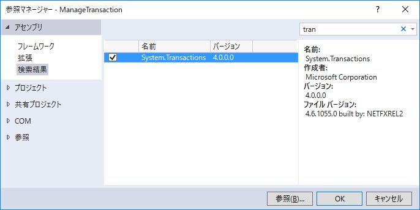

第9章 トランザクション管理
=====

[↑目次](..\README.md "目次")

[←第8章 ストアド・プロシージャ](08-call-stored-procedure.md)

実際にアプリケーションを作成する際、DBアクセスにはトランザクション管理が欠かせません。本章ではトランザクションの開始、終了をどのように制御するのか学びましょう。

## ①手動トランザクション

まず、トランザクションをすべて手動で管理する方法です。トランザクションを制御するには、DbTransactionクラスを用います（リスト9-1）。

リスト9-1 手動トランザクション（Program.csのMainメソッドより）

```csharp
// ①手動トランザクション
// (1) トランザクション開始
using (var dbTransaction = dbConnection.BeginTransaction())
{
  try
  {
    // データを更新する
    using (var dbCommand = dbConnection.CreateCommand())
    {
      dbCommand.CommandText = $@"
        update EMP
        set
         ENAME = 'SMITH'
        where
         EMPNO = 7369
      ";

      // (2) トランザクション設定
      dbCommand.Transaction = dbTransaction;

      var updateCount = dbCommand.ExecuteNonQuery();

      Console.WriteLine($"UPDATE COUNT : {updateCount}");
    }

    // (3) トランザクションコミット
    dbTransaction.Commit();
  }
  catch
  {
    // (4) トランザクションロールバック
    dbTransaction.Rollback();
    throw;
  }
}
```

### (1) トランザクション開始

まず、DbConnectionクラスのBeginTransactionメソッドを呼び出し、トランザクションを開始します。戻り値のDbTransactionオブジェクトを使い、以後のトランザクション管理に使います。

なお、DbTransactionクラスもIDisposableインターフェイスを実装していますので、using文を使うことを忘れないで下さい。

### (2) トランザクション設定

トランザクションに参加させたいSQL実行を行うDbCommandオブジェクトのTransactionプロパティに、(1)で取得したDbTransactionオブジェクトを設定します。つまり、複数のトランザクションを併用して、別々のSQL実行を行うことも可能だということです。

### (3) トランザクションコミット

トランザクション内のSQLを実行が全て終わったら、DbTransactionクラスのCommitメソッドを呼び出し、トランザクションをコミットして終了させます。

### (4) トランザクションロールバック

何かしらのエラー（業務エラー、実行エラーに関わらず）が発生した際は、DbTransactionクラスのRollbackメソッドを呼び出し、トランザクションをロールバックします。この時、実行エラーを漏れ無く補足するため、例外型を指定しないcatchブロックにてロールバックし、その後throw文で例外を再スローします。

なお、Commitメソッド、Rollbackメソッドのどちらも呼ばれずにDisposeメソッドが呼ばれると、トランザクションはロールバックされます。したがって、usingブロックを使っていればcatchブロックは無くても、例外発生時はロールバックされます。

ただ、明示的にロールバックしている方が、プログラムの意図がわかりやすいので、省略しない方をお勧めしておきます。

## ②自動トランザクション

次に、自動でトランザクションを管理してくれる方法です。それにはSystem.Transactions.dllに含まれる、System.Transactions.TransactionScopeクラスを使います（リスト9-2）。コードを書く前にSystem.Transactions.dllへの参照を追加し（図9-1）、using句を使ってSystem.Transactions名前空間をインポートしておきましょう。

```csharp
using System.Transactions;
```



図9-1 System.Transactionsへの参照追加

リスト9-2 自動トランザクション（Program.csのMainメソッドより）

```csharp
// (1) トランザクションスコープ作成
using (var transactionScope = new TransactionScope())
{
  // データを更新する
  using (var dbCommand = dbConnection.CreateCommand())
  {
    dbCommand.CommandText = $@"
        update EMP
        set
         ENAME = 'SMITH'
        where
         EMPNO = 7369
      ";

    var updateCount = dbCommand.ExecuteNonQuery();

    Console.WriteLine($"UPDATE COUNT : {updateCount}");
  }

  // (2) トランザクション完了
  transactionScope.Complete();
}
```

### (1) トランザクションスコープ作成

TransactionScopeクラスの新しいインスタンスを作成することで、自動トランザクションを開始します。このTransactionScopeインスタンスはIDisposableインターフェイスを実装しており、Disposeメソッドが呼ばれるまでがトランザクションの範囲になります。

実際に使用する際は、using文を使って、トランザクション範囲をコードブロックとして表すのがわかりやすいでしょう。

トランザクションスコープを作成すると、その後実行されるSQLは明示的にトランザクションの設定を行わなくとも、現在開始しているトランザクションの中で実行されます。このことと利用すると、業務ロジック層でデータ プロバイダーのことを意識せずとも、トランザクションの範囲を明示できるという利点があります。

### (2) トランザクション完了

transactionScopeクラスのCompleteメソッドを呼び出すと、トランザクションをコミットして完了します。using文を使っていれば、Completeメソッドを呼び出さずにブロックを終えると、自動でロールバックされるということになります。

非常に便利なTransactionScopeですが、内部的にはトランザクション管理を担当する別のサービスプロセスに処理を移管しているため、その「トランザクション管理サービス」が提供されているDB製品でしか利用できません。SQL ServerやOracle Databaseなど主要な有償DB製品ならまず問題ありませんが、その他のDB製品ではよく調査してから使うようにしてください。


トランザクション管理も行えるようになったので、あと残ったDBアクセス処理はエラー処理だけです。次の章では、そのエラー処理について学びます。
[→第10章 例外処理](10-handle-exception.md)
