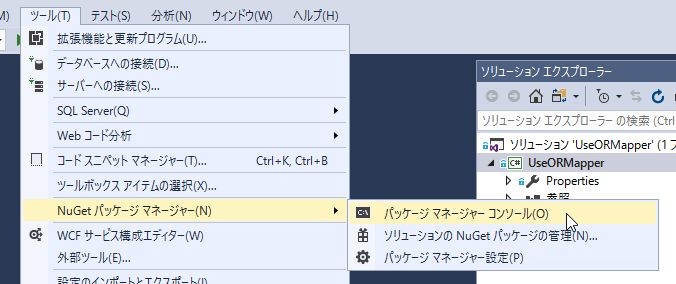
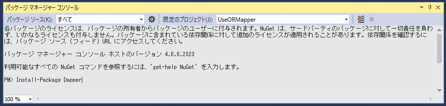

第11章 O/Rマッパーの利用
=====

[↑目次](..\README.md "目次")

[←第10章 例外処理](10-handle-exception.md)

これまで第3章から第9章までで見てきたように、DbCommandやDbDataReaderを使ったDBアクセスは操作が煩雑ですし、型やDBNullの考慮も必要で、少々面倒なことは否めません。こういった面倒さを軽減するため、昨今ではO/Rマッパー（Object-Relational Mapper）と呼ばれる、サポートライブラリを使うことも良くあります。今回はその中でも、「軽量」なO/Rマッパーの1つである「Dapper」の使い方を学びましょう。

## O/Rマッピング

アプリケーションからDBアクセスする際、目的の項目の値を取得するには、その名前であくせすし、DBNullを考慮しつつ目的の型に変換するとうことを、必要な項目全部に行わないといけませんでした。しかし、こういった処理は実際はほとんど同じような処理の繰り返しになってしまい、全部のコードを手入力するのは割に合いません。

そこで、DBの項目とアプリケーションで使う項目を、自動的に関連付けて値のやり取りができたら良いと思いませんか？そういったことを請け負ってくれるのが、「O/Rマッパー（Object-Relational Mapper）」です。

O/Rマッパーはその名の通り、アプリケーション側のオブジェクトとRDBMSのテーブルの項目をマッピングし、DBNullや型も考慮して自動的に値をやり取りできる仕組みです。大きなものではSQL自体をアプリケーション側からは完全に排除するような物もありますし、単にSQLの実行部分に絞った物もあります。

例えば、ADO.NETに含まれる「[Entity Framework](https://msdn.microsoft.com/ja-jp/library/bb399567.aspx)」は、アプリケーションコードからSQLは見えずに、完全にオブジェクト操作をRDBMSに反映させるような仕組みになっています。したがって、従来のDBアクセスの知識とはまた別の概念を新たに学ばないと、効果的に使うことは出来ません。

それに対して、SQL実行部分に絞ったものが、今回紹介する「[Dapper](https://github.com/StackExchange/dapper-dot-net)」です。DapperはQ&Aサイトである「Stack Overflow」を運営しているStack Exchangeが開発している、オープンソースのO/Rマッパーで、SQL実行時のパラメータ設定や問い合わせ時のデータ取得等を楽にしてくれるライブラリです。

## Dapperのインストール

Dapperをアプリケーションで使うには、NuGetを通じてライブラリをインストールするだけです。VSの「ツール」メニュー→「NuGet パッケージ マネージャー」→「パッケージ マネージャー コンソール」をクリックしてください（図11-1）。



図11-1 パッケージ マネージャー コンソールの起動

次に「パッケージ マネージャー コンソール」で以下のコマンドを実行して、Dapperをインストールします（図11-2）。

```
PM> Install-Package Dapper
```



図11-2 Dapperインストール

最後に、使用するソースコードの先頭に、usingを使ってDapper名前空間をインポートします。

```csharp
using Dapper;

```

## マッピング型定義

最初に行うのは、「マッピング」するための型です（リスト11-1）。

リスト11-1 マッピング型定義（Program.csより）

```csharp
  // マッピング型定義 
  class Employee
  {
    public int EMPNO { get; set; }
    public string ENAME { get; set; }
    public string JOB { get; set; }
    public int? MGR { get; set; }
    public DateTime HIREDATE { get; set; }
    public decimal SAL { get; set; }
    public decimal? COMM { get; set; }
    public int DEPTNO { get; set; }
  }
```

マッピング型にはSQLに記載する列名、項目名と同じ名前のプロパティを作成します。この時、DB上でNULLになる可能性がある値型の項目は、null許容型として定義するのがポイントです。

これで準備が整ったのでDapperを使ったSQL実行に入っていきましょう。

## ①問い合わせ

まずは問い合わせです（リスト11-2）。

リスト11-2 問い合わせ（Program.csのMainメソッドより）

```csharp
// ①問い合わせ
// (1) SQL実行
var employees = dbConnection.Query<Employee>(
  @"
    select
     EMPNO
    ,ENAME
    ,JOB
    ,MGR
    ,HIREDATE
    ,SAL
    ,COMM
    ,DEPTNO
    from
     EMP
    where
     ENAME like :ENAME || '%'
  ",
  new { ENAME = ename }
);

// (2) 取得データを列挙
foreach (var employee in employees)
{
  // (3) 取得データを表示
  Console.WriteLine(
    $"{employee.EMPNO}"
    + $"\t{employee.ENAME}"
    + $"\t{employee.JOB}"
    + $"\t{employee.MGR}"
    + $"\t{employee.HIREDATE:yyyy/MM/dd}"
    + $"\t{employee.SAL,6:#,##0}"
    + $"\t{employee.COMM,6:#,##0}"
    + $"\t{employee.DEPTNO}"
  );
}
```

### (1) SQL実行

DbCommandクラスのQuery<T>拡張メソッドを呼び出して、問い合わせSQLを実行します。この時型引数Tには、SELECT文の実行結果をマッピングする対象の型を指定します。今回はEMP表のデータを取得するので、型引数にはEmployee型を指定します。

Query<T>メソッドの第一引数は、実行するSQL文です。通常の問い合わせと同じようにSELECT文を書けばよいだけです。もちろんパラメーターも使えます。

Query<T>メソッドの第二引数は、パラメーターと同名のプロパティを持つオブジェクトを設定します。パラメーターは問い合わせで取得する型とは項目が違うケースが多く、匿名型を使うのが良いでしょう。もちろん、Employee型のように定義された型のオブジェクトでも問題はありません。

### (2) 取得データ列挙

Query<T>メソッドの戻り値はIEnumerable<T>型になります。サンプルでは型引数にEmployee型を指定したので、戻り値はIEnumerable<Employee>型です。したがって、foreach文によって値の列挙が可能です。

なお、当然LINQを使って絞り込んだり、集計することも出来ます。

### (3) 取得データ表示

foreach文によって列挙された項目は当然Employee型として扱えるので、各プロパティにアクセスすることで、SQLで取得した各項目の値を取得できます。この時、DbDataReaderを使うときに必要だった型変換やDBNullだった場合自動的にnullにするような処理は、Dapperが代わりに行ってくれているため、アプリケーション側では意識する必要がありません。


## ②スカラー値取得

次はスカラー値取得です（リスト11-3）。

リスト11-3 スカラー値取得（Program.csのMainメソッドより）

```csharp
// ②スカラー値取得
// (1) SQL実行
var employeeCount = dbConnection.ExecuteScalar<int>(
  @"
    select
     COUNT(EMPNO)
    from
     EMP
    where
     ENAME like :ENAME || '%'
  ",
  new { ENAME = ename }
);

// (2) 実行結果表示
Console.WriteLine($"総社員数 : {employeeCount}");
```

### (1) SQL実行

スカラー値を取得するには、DbConnectionクラスのExecuteScalar<T>拡張メソッドを呼び出します。型引数Tは取得するスカラー値の型に合わせて指定します。今回は件数を取得するので、int型を指定しています。後の引数はQuery<T>メソッドと同じです。

### (2) 実行結果表示
ExecuteScalar<T>拡張メソッドの戻り値はT型になります。サンプルコードではint型になるので、そのまま表示しています。

## ③非問い合わせ

最後は非問い合わせです（リスト11-4）。

リスト11-4 非問い合わせ（Program.csのMainメソッドより）

```csharp
// ③非問い合わせ
// (1) SQL実行
var updatedCount = dbConnection.Execute(
  @"
    update EMP
    set
     ENAME = :ENAME
    where
     EMPNO = :EMPNO
  ",
  new Employee
  {
    ENAME = "SMITH",
    EMPNO = 7369
  }
);

// (2) 更新件数表示
Console.WriteLine($"更新件数 : {updatedCount}");
```

### (1) SQL実行

非問い合わせSQLを実行するには、Execute拡張メソッドを呼び出します。引数はQuery<T>メソッドと同じです。サンプルのように、パラメータには実際に定義されている型のオブジェクトを使うことが出来ます。

### (2) 更新件数表示

Executeメソッドの戻り値は、DbCommandクラスのExecuteNonQueryと同じく、影響を受けた行数です。サンプルではUPDATE文により更新されたレコード件数を取得して表示しています。


## トランザクション

手動トランザクションを考慮したSQL実行は、それぞれのDapperのメソッドの第三引数に、トランザクションオブジェクトを渡してやるだけで良いです（リスト11-5）。

リスト11-5 トランザクション（Program.csのMainメソッドより）

```charp
dbConnection.Execute(
  @"
    update EMP
    set
     ENAME = :ENAME
    where
     EMPNO = :EMPNO
  ",
  new Employee
  {
    ENAME = "SMITH",
    EMPNO = 7369
  },
  dbTransaction // トランザクションオブジェクト
);
```

当然のことながら、TransactionScopeを使った自動トランザクションなら、こういった配慮は不要です。


## 最後に

11章にわたって.NET データプロバイダーを用いたDBアクセスについて説明してきました。本文書の内容で、まず大体のDBアクセス処理は行えるはずです。

しかし、実際のアプリケーション開発においては、どうしても各DB製品、データプロバイダーの機能を使わざるをえない場合もあります。そういった時は本書の内容を応用し、各製品のマニュアル等を参考に対処してもらえればと思います。

また、今回紹介しなかった「ADO.NET Entity Framework」等の最新のデータアクセステクノロジーについても、ハマればとても高い生産性を発揮するものなので、ぜひ折を見て学習しておくことをお勧めします。

さらに、DBアクセス処理を突き詰めていくと、結局のところデータモデリングやRDBMS自体についても深い知識が要求されるようになります。したがって、そういった方面の学習もぜひ行っていってください。
